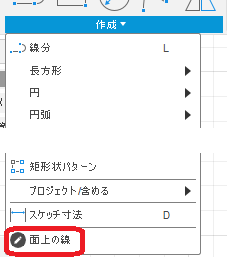
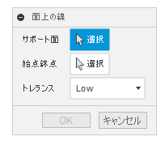
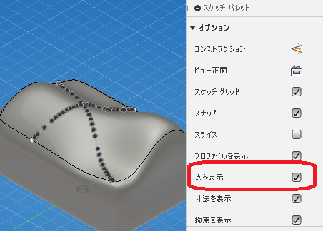

# **Fusion360_DrawCurveOnSurface**
Autodesk社 ソフト <b>"Fusion360" </b> のアドインです。

## 特徴:
スケッチ作業時に、指定した面上に線を描くためのコマンドです。

## 設置:
こちらの手順に従い、アドインとして「DrawCurveOnSurface」フォルダを追加してください。

[Fusion 360にアドインまたはスクリプトをインストールする方法](
https://knowledge.autodesk.com/ja/support/fusion-360/troubleshooting/caas/sfdcarticles/sfdcarticles/JPN/How-to-install-an-ADD-IN-and-Script-in-Fusion-360.html)

## 使用:
アドイン実行すると、スケッチ作業時の「スケッチ」タブの「作成」の一番下に「面上の線」
コマンドが追加されます

コマンド実行時は以下のダイアログが出ます。

予め線を描く面を選択し、面の境界/頂点を2ヶ所選択することで、2点間の(UV的に)最短を結ぶ線を面上に描きます。
出来上がる線は3Dスケッチとして作成したものと同等のものになります。
コントロールポイントが表示され見えにくい場合は、スケッチパレットの「点の表示」のチェックを
外す事で見やすくなります。

トレランスの設定に関わらず、作成される曲線は
+ 頂点選択時は、曲線の端点は頂点と一致します。
+ 境界選択時は、曲線の端点は境界線上と一致します。
+ 各コントロールポイントは選択面と一致します。

## 動作:
以下の環境にて確認。
+ Fusion360 Ver2.0.8156
+ Windows10 64bit Home/Pro

## ライセンス:
MIT

## 残された問題:
+ 面上を自由に選択可能にする
+ プレビューの線が細い

## 謝辞:
+ こちらの便利な[フレームワーク](https://github.com/tapnair/Fusion360AddinSkeleton)を試用しました。
 Patrick Rainsberryさん、ありがとう。
+ [日本語フォーラム](https://forums.autodesk.com/t5/fusion-360-ri-ben-yu/bd-p/707)の皆さん、ありがとう。
+ アイコンが貧弱なので、センスの良い方提供して頂けると助かります・・・。